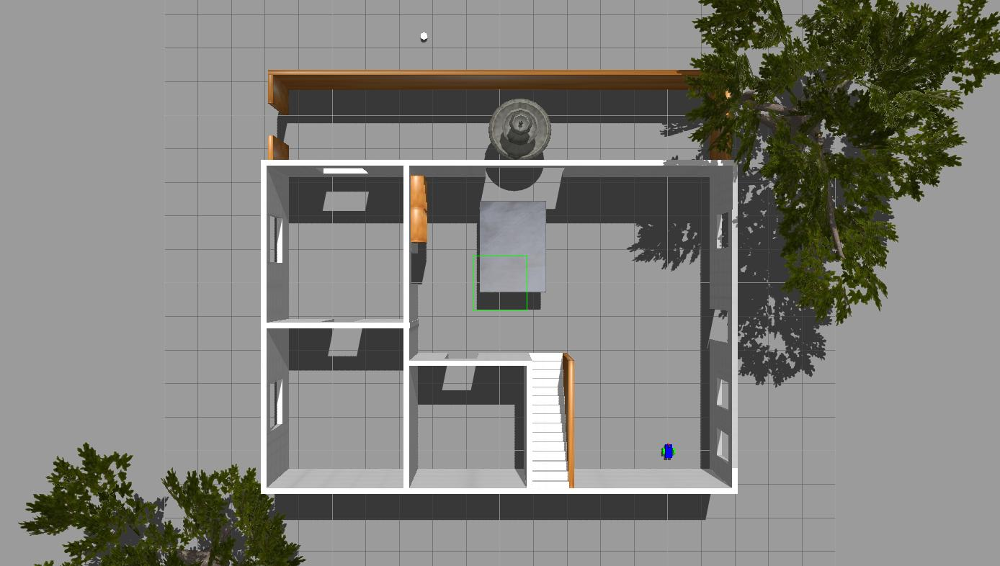
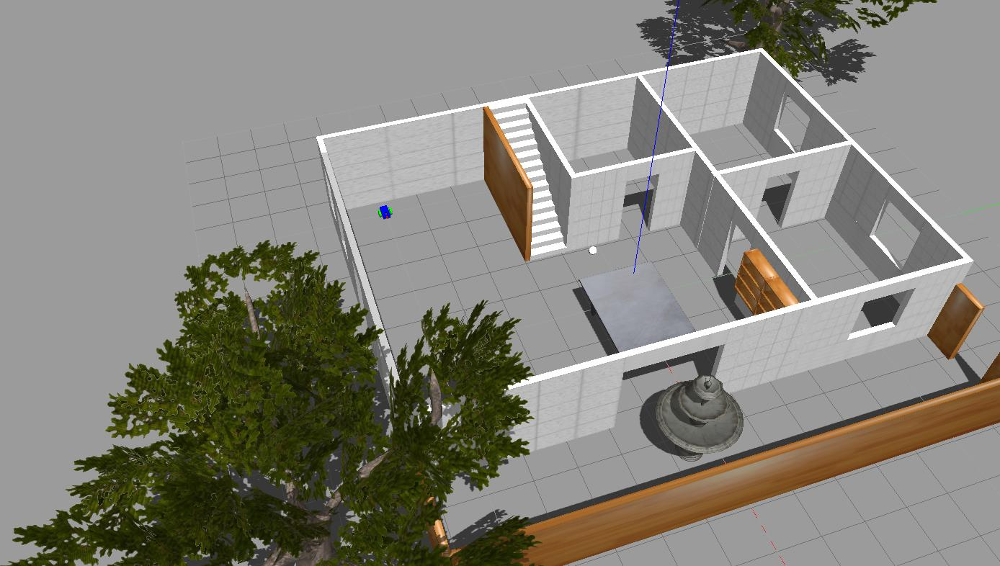

# Ball Chaser

This ROS package contains to nodes that act as server and client.

The communication is done between the camera and the drive_bot node.

The process_image node determines the direction in which the robot should drive, depending on the messages sent by the camera.

* drive_bot: server
* process_image: client

## Compute graph

Diagram of nodes, topics.

## World 

## Robot Chasing the ball

